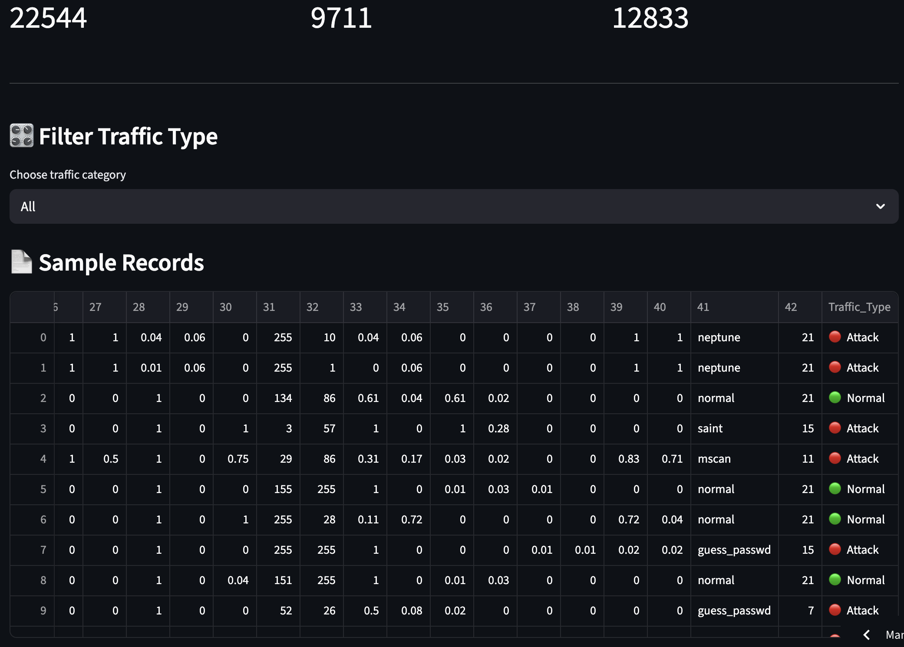
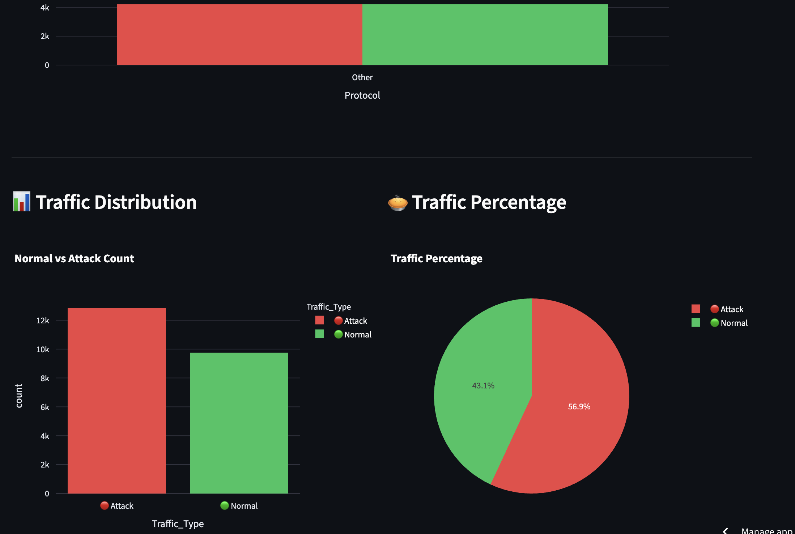
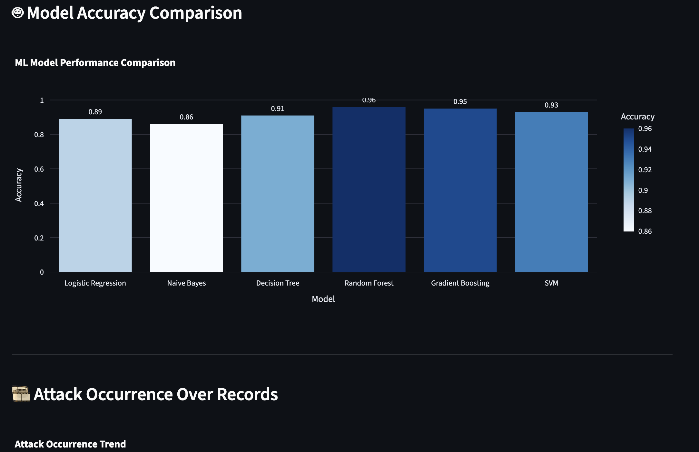

# 🛡️ Adaptive Intrusion Detection System

An end-to-end **Machine Learning–based Intrusion Detection System** that detects malicious network traffic using both **offline datasets** and **real-time packet inspection**.

This project demonstrates the practical application of **machine learning in cybersecurity**, combining data analysis, model training, real-time detection, and interactive visualization.

---

## 🚀 Features

### 🔹 Offline Intrusion Detection
- Trained on **NSL-KDD dataset**
- Binary classification: **Normal vs Attack**
- Multiple ML models evaluated
- Best-performing model selected

### 🔹 Real-Time Intrusion Detection (Local)
- Live packet capture using **Scapy**
- Lightweight ML model for live traffic
- Real-time console alerts
- Works with Chrome / Safari traffic

### 🔹 Interactive Dashboard (Streamlit)
- Upload NSL-KDD dataset
- Interactive & animated charts
- Protocol-wise attack analysis
- Model accuracy comparison
- Downloadable CSV & PDF reports

---

## 🧠 Machine Learning Models Used
- Logistic Regression  
- Naive Bayes  
- Decision Tree  
- Random Forest ⭐  
- Gradient Boosting  
- Support Vector Machine (SVM)

---

## 🛠 Tech Stack
- Python  
- Pandas, NumPy  
- Scikit-learn  
- Scapy  
- Plotly, Matplotlib, Seaborn  
- Streamlit  

---

## 📂 Project Structure
Adaptive-Intrusion-Detection-System/
├── data/
├── model/
├── train_ids.ipynb
├── live_ids.py
├── streamlit_app.py
├── requirements.txt
└── README.md

## 📸 Screenshots

### filter_traffic

### traffic type

### ml model accuracy

## 🚀 Live Demo
👉 https://pt3bissvmgsyk8bd4jtdom.streamlit.app/
